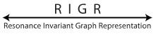

# RIGR
Welcome to the home branch for RIGR.  
**60% fewer features, resonance invariant, same high performance!**

Resonance Invariant Graph Representation (RIGR) is a featurizer implemented as part of **Chemprop v2**, designed to impose resonance invariance for molecular property prediction tasks.

- **For CLI users**: Add the `--rigr` flag to your Chemprop script to train (or infer) models using this featurizer. An example bash script can be found [here](https://github.com/akshatzalte/chemprop/blob/rigr_home/examples/hpopt_train_predict_rigr.sh).
- **For Jupyter Notebook users**: Refer to our [example notebook](https://github.com/akshatzalte/chemprop/blob/rigr_flag/notebooks/rigr_flag_notebook.ipynb) to use RIGR in a notebook environment.

RIGR is introduced and discussed in our work: [RIGR: Resonance Invariant Graph Representation for Molecular Property Prediction](). It ensures consistent treatment of different resonance structures of the same molecule, including non-equivalent resonance forms. By using RIGR, users can avoid manually selecting a specific resonance form for molecules or radicals exhibiting resonance. If you find RIGR helpful in your research, please consider citing our [paper]().

RIGR uses only the subset of atom and bond features from Chemprop that remain invariant across different resonance forms. The tables below indicate which atom and bond features are present and absent in RIGR.

### Atom Features

| **Feature**            | **Description**                                                                 | **Present in RIGR?** |
|------------------------|---------------------------------------------------------------------------------|:--------------------:|
| Atomic&nbsp;number     | The choice for atom type denoted by atomic number                                | ☑️                   |
| Degree                 | Number of direct neighbors of the atom                                           | ☑️                    |
| Formal&nbsp;charge     | Integer charge assigned to the atom                                              | ☐                   |
| Chiral&nbsp;tag        | The choices for an atom's chiral tag (See `rdkit.Chem.rdchem.ChiralType`)        | ☐                   |
| Number&nbsp;of&nbsp;H  | Number of bonded hydrogen atoms                                                  | ☑️                   |
| Hybridization          | Atom's hybridization type (See `rdkit.Chem.rdchem.HybridizationType`)            | ☐                   |
| Aromaticity            | Indicates whether the atom is aromatic or not                                    | ☐                   |
| Atomic&nbsp;mass       | The atomic mass of the atom                                                      | ☑️                   |

### Bond Features

| **Feature**           | **Description**                                                                                      | **Present in RIGR?** |
|-----------------------|------------------------------------------------------------------------------------------------------|:--------------------:|
| Bond&nbsp;type        | The known bond types: single, double, or triple bond                                                 | ☐                   |
| Conjugation           | Indicates whether the bond is conjugated or not                                                     | ☐                   |
| Ring                  | Indicates whether the bond is a part of a ring                                                      | ☑️                    |
| Stereochemistry       | Stores the known bond stereochemistries (See [BondStereo](https://www.rdkit.org/docs/source/rdkit.Chem.rdchem.html#rdkit.Chem.rdchem.BondStereo.values)) | ☐                    |

## Branch Guide

The table below provides details on which branch corresponds to specific analyses in our work:

| Branch Name     | Purpose                                                   |
|------------------|-----------------------------------------------------------|
| [`rigr_home`](https://github.com/akshatzalte/chemprop/tree/rigr_home)     | Home branch with all necessary information to learn about RIGR |
| [`rigr_flag`](https://github.com/akshatzalte/chemprop/tree/rigr_flag) | Implements `rigr` as a flag for easy use in CLI along with optional molecular charge and multiplicity features |
| [`rigr`](https://github.com/akshatzalte/chemprop/tree/rigr) | The branch used for training all the `rigr` models in the [paper]() |
| [`native`](https://github.com/akshatzalte/chemprop/tree/native) | The branch used for training all the `native` and `native+aug` models in the [paper]() |
| [`rigr_charge`](https://github.com/akshatzalte/chemprop/tree/rigr_charge)  | Same as `rigr` but with additional molecule level charge featurizer — used for most property prediction benchmarks |
| [`rigr_charge_stereo_chiral`](https://github.com/akshatzalte/chemprop/tree/rigr_charge_stereo_chiral)  | Same as `rigr_charge` but with bond stereochemistry and atom chirality features — used for [RGD1 benchmark](./benchmarks/barrier_rgd1_cnho) |
---

